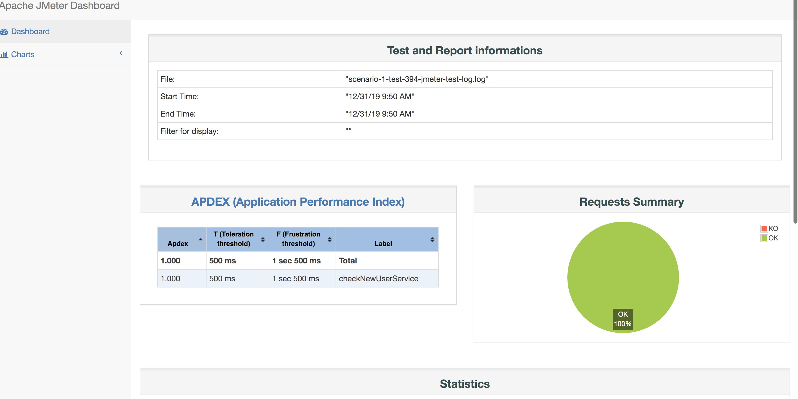

# jmeter-docker
<h1>Setting up JMeter on Docker</h1>

参考ajeetraina/jmeter-docker 项目，感谢

主要包括三部分内容， base镜像， master镜像， slave镜像（这里是实现jmeter master 分发到slave机器执行压测，用swift 完成执行脚本，执行报告， log等下发和上传

<b>Pre-requisite:</b>

1. Docker
2. python-swiftclient


## Base
Base镜像内置ubuntu，jmeter环境配置， jmeter插件等

## Master
基于Base镜像，内置shell脚本，jmeter-master.sh 实现
1 下载压测计划
2 执行压测
3 上传日志
4 压缩report并上传


## Slave
Slave下载jmeter压测计划的配置文件等， 譬如参数.txt之类的。然后再开始运行jmeter

注*：
master salve 模式下， 如果压测有配置文件相关项， 一定要copy到slave，这样slave jmeter才能工作

## 环境变量
shell脚本中使用的ST_CONTAINER 环境变量， 需要在yaml中定义
用到存储secret or key， 使用k8s secret

## Yaml
```yaml
{ spec:
   { restartPolicy: 'Never',
     containers:
      [ { image: 'jmeter-master:v1.0.1',
          name: 'test',
          env:
           [ { name: 'PAAS_TYPE', value: 'lptp' },
             { name: 'JMETER_TEST_PLAN', value: 'test-jmeter-test-plan.jmx' },
             { name: 'JMETER_TEST_LOG', value: 'test-jmeter-test-log.log' },
             { name: 'JMETER_TEST_REPORT',
               value: 'test-jmeter-test-report.zip' },
             { name: 'JMETER_SLAVE_HOSTS', value: '1.1.1.2,1.2.4.1' },
             { name: 'JMETER_LOG', value: 'test-jmeter.log' },
             { name: 'ST_CONTAINER',
               valueFrom: { secretKeyRef: { name: 'test', key: 'random' } } },
             { name: 'ST_KEY',
               valueFrom: { secretKeyRef: { name: 'test', key: 'random' } } } ],
          imagePullPolicy: 'IfNotPresent',
          resources:
           { requests: { memory: 500Mi, cpu: 2 },
             limits: { memory: 500Mi, cpu: 2 } } } ],
     dnsPolicy: 'Default' },
  metadata:
   { labels: { app: 'test-jmeter-master-1' },
     namespace: 'lptp',
     name: 'test-jmeter-master-1' } }

```

最后产出报告:
<!--  -->


报告是压缩成zip包后可以下载到本地查看， 如果想要在线查看， 可以起个django服务， 这部分代码我就不上传了，如果有需要也可以给我留言